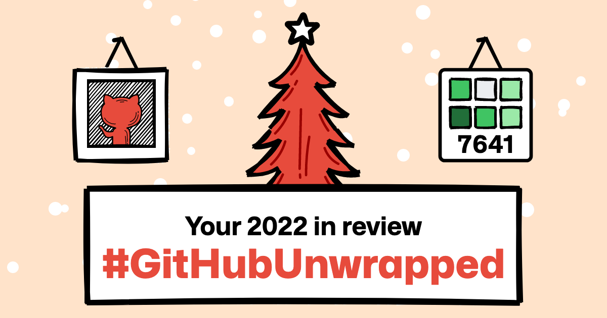
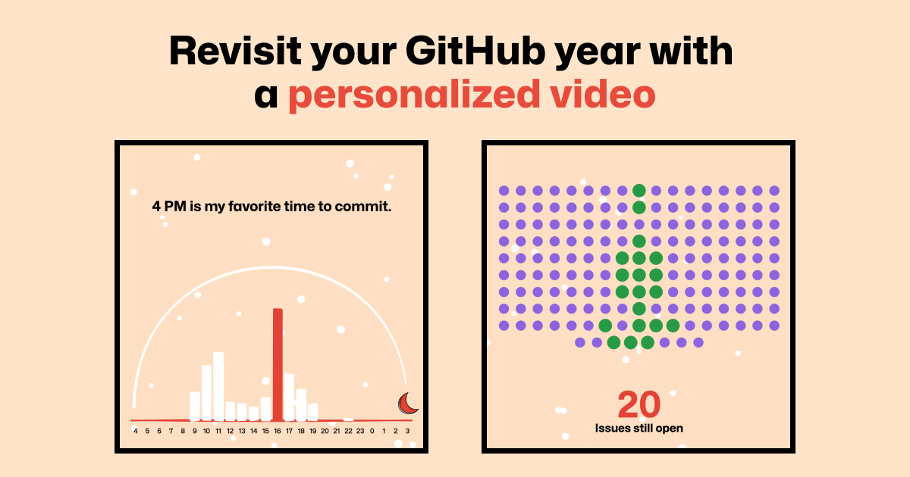
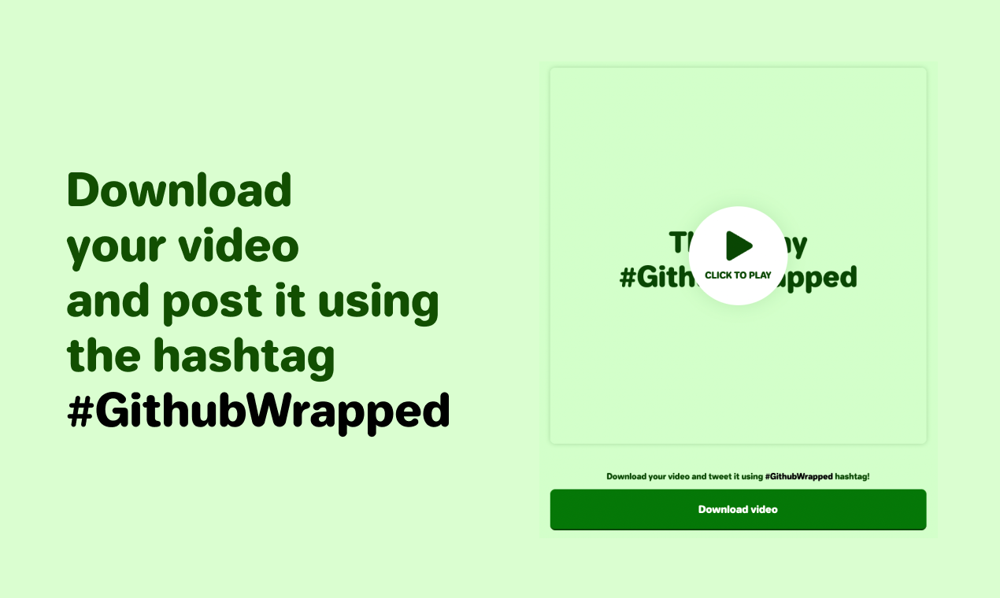

**Try it out live:** https://githubunwrapped.com

A platform that generates a year in review video for each GitHub user. Built with Next.JS, Remotion and AWS Lambda.

## Scaling strategy

To allow hundreds of people to render their video at the same time, we applied multiple strategies for scaling:

- Caching the video whenever possible. Before each render, a database lock is created to avoid multiple renders for the same GitHub user to be accidentally created.
- A random region will be selected for each render to distribute renders to avoid hitting the [concurrency limit](https://www.remotion.dev/docs/lambda/troubleshooting/rate-limit).
- Two AWS sub-accounts are used for rendering which each have their own concurrency limit of 1000 functions in parallel per region. In hindsight, it would have been easier to ask AWS for an increase.

## Setup

1. Run `npm i` to install dependencies.
2. Rename `.env.example` to `.env`
3. Set up your AWS account according to the [Remotion Lambda Setup guide](https://remotion.dev/docs/lambda/setup). We use multiple accounts for load-balancing:
   - Use `AWS_KEY_1` instead of `REMOTION_AWS_ACCESS_KEY_ID` and `AWS_SECRET_1` instead of `REMOTION_AWS_SECRET_ACCESS_KEY`.
   - You can use `AWS_KEY_2` and `AWS_SECRET_2` to load-balance between two accounts, or paste the same credentials as before to use the same account.
   - In `src/set-env-for-key.ts`, we rotate the environment variables.
4. Deploy the functions into your AWS account(s):
   ```
   npm deploy-functions
   ```
5. For caching the videos and GitHub API responses, set up a MongoDB (I use a free MongoDB Atlas Cloud instance) to save the videos. Set the connection string as `MONGO_URL`
6. For fetching data from GitHub, create a personal access token in your user settings and set it as `GITHUB_TOKEN`.

You now have all environment variables.

Run the web app:

```console
npm run dev
```

Edit the template in the Remotion preview:

```console
npm run preview
```

To deploy, connect your repository to Vercel or Heroku.

Don't forget to also set the environment variables there too.

## License

The code in this repository: Licensed under MIT.  
The Remotion library: Notice that for some entities a company license is needed. Read the terms [here](https://github.com/remotion-dev/remotion/blob/main/LICENSE.md#company-license).
